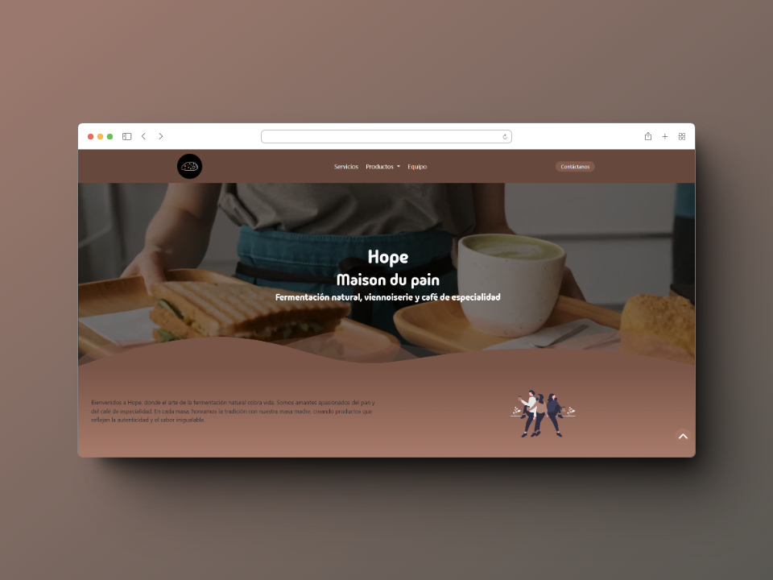
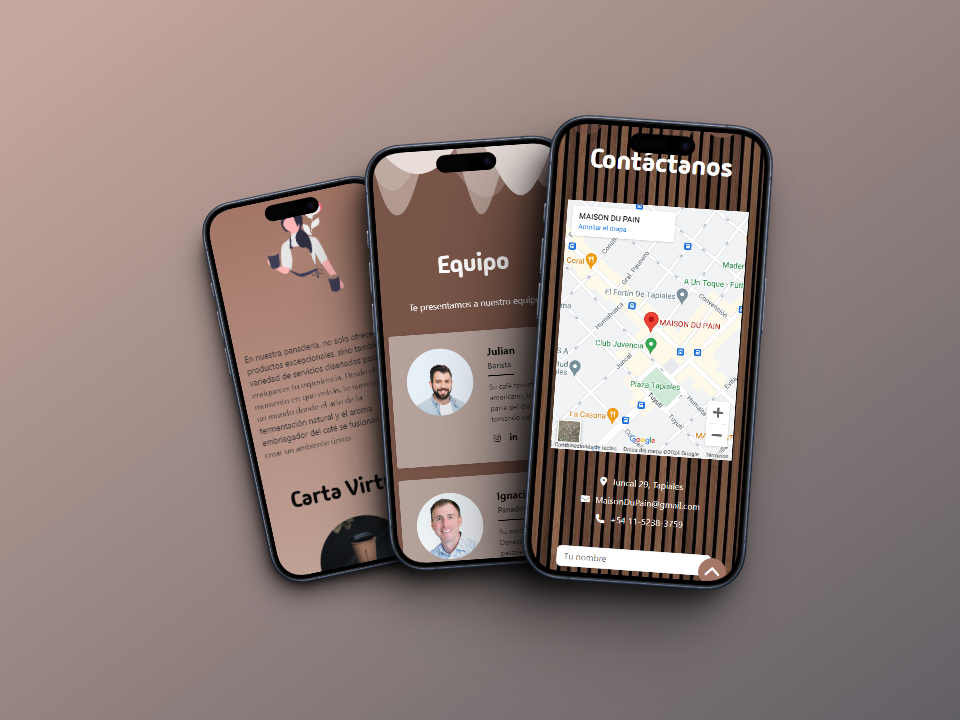

  <h1>Proyecto Final - Coderhouse</h1>
  
¡Bienvenido/a al repositorio de mi proyecto final de CoderHouse!

  <h2>Descripción del Proyecto</h2>
  
Este proyecto es el resultado de mi trabajo durante el curso de CoderHouse. Pude crear un sitio web utilizando HTML, CSS, BOOTSTRAP y SASS, haciendo uso de las buenas practicas del desarrollo. Este proyecto es una landing page inspirado en una panaderia cuyo nombre es Hope.

  <h2>Imagenes sobre Hope</h2>
  
  
  

